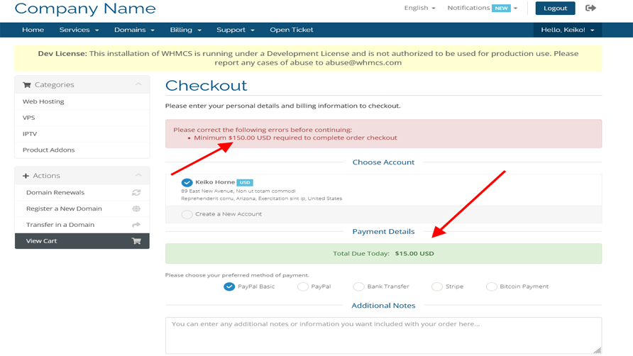

# Minimum Cart Total for WHMCS
**Minimum Cart Total** module allows you to setup minimum required total per currency.

**Features**

- Set Minimum Required Total For Orders
- Multi currency supports
- Working WHMCS v8.x
- Without any template changes
- Working with any WHMCS templates

## Install

Download addon latest version form [latest release](https://github.com/farzadkhaledi/minimumcart/releases/latest) and extract files, then upload **minimumcart** folder to YOUR_WHMCS_ROOT/modules/addons folder.

Then login to your WHMCS admin area and in System Settings -> Addons Modules active **Minimum Cart Total** addon.

## Folders

<pre>
minimumcart/
├── minimumcart.php
├── hooks.php
├── index.php
├── whmcs.json
├── logo.png
└──  lang/
    ├── index.php
    └── english.php
</pre>

## License

All contents are licensed under the [MIT license].

[mit license]: LICENSE
